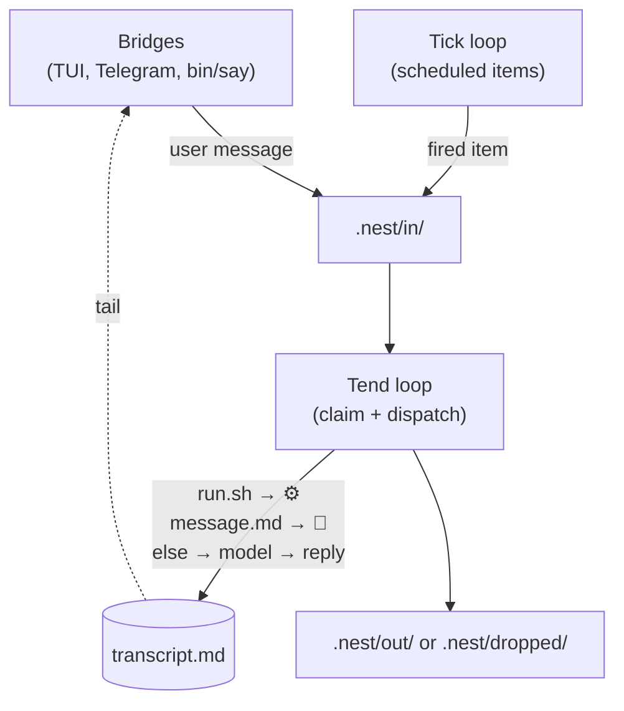

# 👀 gremlin

gremlin is a simple AI agent that lives in a folder. Copy `.gremlin/` into a folder, that folder is now an agent.

Connect it to Claude Code, OpenAI Codex, Open Code, Pi, your local models - anything that pipes to the CLI. 


## Quick Start

### Install gremlin into the current directory

```sh
curl -fsSL https://raw.githubusercontent.com/zealtv/gremlin/main/install.sh | bash -s
```

### Configure a model preset

Model presets are just executables that read a prompt on stdin and write a reply on stdout. The default preset is `.gremlin/models/default.sh` which looks like this (edit it to match the model CLI you want to use):

```sh
#!/usr/bin/env bash
# claude sonnet 4.6
set -euo pipefail
exec claude -p --model claude-sonnet-4-6 --allowedTools "Bash"
```

### Start the runner

```sh
.gremlin/gremlin start
```

### Run the TUI

```sh
.gremlin/gremlin tui
```

Run `/help` for to list commands.

### Customize the gremlin:

- `.gremlin/gremlin.md`: identity, personality, purpose, voice.
- `.gremlin/context/`: facts loaded into every prompt.
- `.gremlin/skills/`: markdown skills.
- `.gremlin/tools/`: bash tools.
- `.gremlin/models/`: model presets.


## Structure

```
Host_Directory/
└── .gremlin/
    ├── .glean/              <- memory
    ├── .groundhog/          <- scheduled items
    ├── .nest/               <- inbound/completed items
    ├── bin/
    ├── bridges/             <- TUI and Telegram bridges
    ├── commands/            <- slash commands
    ├── context/             <- facts loaded into every prompt
    ├── docs/
    ├── models/              <- model presets
    ├── skills/              <- markdown procedures
    ├── transcript-archive/  <- archived sessions
    ├── tools/               <- bash tools
    ├── .upstream     
    ├── README.md
    ├── gremlin             <- gremlin executable
    ├── gremlin.md          <- identity, personality, purpose, voice
    └── transcript.md       <- current session
```

## Message Lifecycle



1. **Bridges and `gremlin say` deposit each user message as an item in `.nest/in/`**.
2. **The tick loop drops scheduled items from groundhog into the same `.nest/in/`**, so all inbound work shares one funnel.
3. **The tend loop claims one ready item at a time** (renaming it `.tending`) and dispatches by shape: 
  - an executable `run.sh` runs as a script, 
  - a lone `message.md` is emitted verbatim, 
  - anything else goes to the model.
4. **For model-backed items, the tender appends `## user —` to `transcript.md`, builds the prompt** (`gremlin.md` + `context/` + skills/tools/memory indexes + the transcript + the body), **calls the model, and appends `## assistant —`**.
5. **The handled item is archived to `.nest/out/`** (or `.nest/dropped/` if it failed or was aborted by `/stop`); the reply itself lives only in the transcript.
6. **Bridges tail `transcript.md` to fan replies back out** to their channel, closing the loop.

Slash commands (`/stop`, `/help`, …) are a side channel: bridges run them directly via `commands/<cmd>.sh`, bypassing the nest and the model entirely.


## Principles

gremlin uses a family of simple, file-based protocols for messaging, scheduling, and memory.

- 🪺 [nestlings](https://github.com/zealtv/nestlings): queing and actioning work
- 🦫 [groundhog](https://github.com/zealtv/groundhog): scheduling reocurring tasks
- 🔮 [glean](https://github.com/zealtv/glean): memory distillation and retrieval
- 🪡 [loom](https://github.com/zealtv/loom): planning structured work while developing gremlin

Everything is bash and markdown. Simplicity, clarity, and extensibility are the guiding principles.


## Sandboxing

The protocol does not enforce a sandbox. Host a gremlin where broad shell and
file access is acceptable.

For real isolation, wrap `bin/llm.sh` or `bin/run.sh` with OS or harness controls:
a separate UNIX user, container, VM, `sandbox-exec`, `bwrap`, or equivalent.


# More 

User-facing docs live inside the installed gremlin:

- `.gremlin/README.md`
- `.gremlin/docs/protocol.md`
- `.gremlin/docs/composition.md`